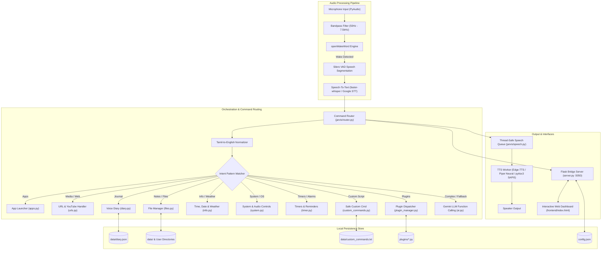
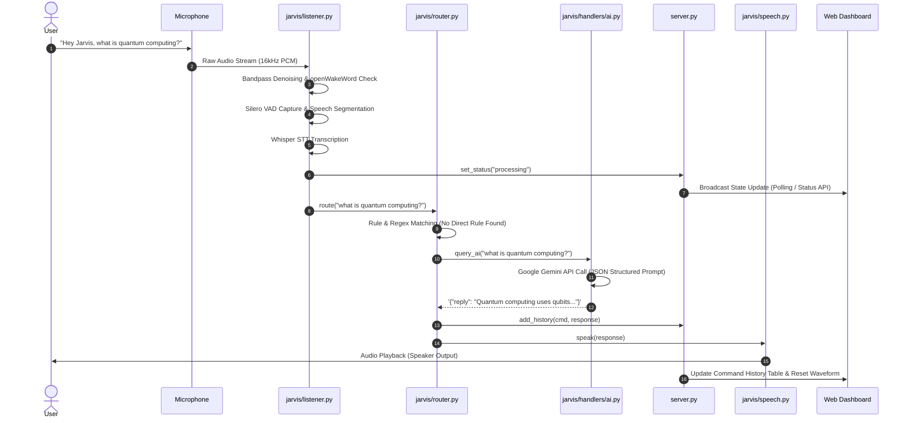

# 🎙️ Jarvis — Intelligent Local-First AI Voice Assistant & Control System

---

## 1. Executive Overview & Problem Statement

### 1.1 Context & Background
Modern voice assistants (such as Amazon Alexa, Apple Siri, and Google Assistant) are predominantly cloud-reliant ecosystems. While capable of answering general knowledge questions, they present notable limitations for developers, power users, and privacy-conscious individuals:
- **Cloud Latency & Network Dependency:** Audio streaming to remote servers introduces latency and renders systems inoperable during internet outages.
- **Privacy & Data Security Concerns:** Audio streams and personal journals/notes are transmitted to proprietary third-party servers.
- **Limited Local System Control:** Commercial smart assistants cannot interact deeply with local filesystems, execute custom developer scripts, launch tailored desktop workflows, or adapt to custom hardware peripherals.
- **Rigid Interaction Models:** Command routing often fails if phrasing deviates from strict commercial templates.

### 1.2 Mission & Solution
**Jarvis** is an intelligent, privacy-first, hybrid-edge voice assistant designed to provide low-latency, hands-free personal computing, home automation, and cognitive AI assistance. 

Jarvis combines on-device neural voice processing (openWakeWord, Silero VAD, faster-whisper, and Piper TTS) with large language model intelligence (Google Gemini AI) and an interactive web management dashboard. Jarvis delivers responsive desktop automation, intelligent voice diary journaling, multi-turn conversational capabilities, local file management, and sandboxed custom command execution.

```
       ┌────────────────────────────────────────────────────────┐
       │                JARVIS SYSTEM PHILOSOPHY                │
       ├──────────────────────────┬─────────────────────────────┤
       │   Local-First Privacy    │   Ultra-Low Latency VAD     │
       │   Extensible Shell Ops   │   Multimodal Web Dashboard  │
       │   Hybrid LLM Reasoning   │   Bilingual Speech Support  │
       └──────────────────────────┴─────────────────────────────┘
```

---

## 2. Architecture & System Design

Jarvis is architected with a decoupled, asynchronous, multi-threaded design comprising six primary tiers:



### 2.1 Frontend Tier (Web UI Dashboard)
- **Technology:** Single-Page Application (SPA) built with semantic HTML5, modern CSS3 (glassmorphism, CSS grid/flexbox, dynamic animations), and Vanilla ES6+ JavaScript.
- **Audio Wave Visualizer:** HTML5 Canvas-based real-time sinusoidal wave animation reflecting assistant phases (`idle`, `waiting`, `listening`, `processing`, `speaking`, `error`).
- **Interactive Controls:**
  - **Live Status & Activity Log:** Real-time state indicator and conversation history feed.
  - **Terminal / Manual Command Prompt:** Send text-based commands directly without speaking.
  - **Smart Home Control Hub:** Real-time interactive controls for lighting, air conditioning temperature regulation, and coffee maker power.
  - **Diary & Journal Viewer:** Full CRUD interface for voice diary entries.
  - **File Explorer & Editor:** In-browser browsing, viewing, and modifying of assistant data files.
  - **Custom Commands Configuration Editor:** In-browser management of custom triggers, actions, and security levels.

### 2.2 Backend Server Tier
- **Technology:** Python Flask microframework (`server.py`) running as a daemon background thread on `http://0.0.0.0:5050`.
- **Concurrency & State Safety:** Uses `threading.Lock()` to synchronize state changes across the audio listening loop, speech worker thread, and HTTP requests.
- **State Ring Buffer:** In-memory `collections.deque(maxlen=50)` storing command transcripts, execution status, and timestamps.
- **Cache-Control Protocol:** Disables HTTP caching (`no-cache, no-store, must-revalidate`) for real-time dashboard synchronization.

### 2.3 Audio Processing & Speech Pipeline
1. **Audio Ingestion & Signal Conditioning:**
   - Captures 16-bit PCM mono audio at 16,000 Hz.
   - Applies an asynchronous 2nd-order Butterworth bandpass filter ($50\text{ Hz} - 7500\text{ Hz}$) via `scipy.signal.sosfilt` to remove electrical hum, HVAC rumble, and high-frequency hiss.
2. **Wake Word Detection:**
   - Primary: `openWakeWord` running an ONNX quantized model analyzing 1280-sample (80ms) sliding frames.
   - Fallback: Phonetic fuzzy matching across variations (e.g., `"hey jarvis"`, `"alexa"`, `"ஜார்விஸ்"`, `"starfish"`, `"service"`).
3. **Voice Activity Detection (VAD):**
   - Implements Silero VAD (ONNX runtime) analyzing 512-sample (31.25ms) frames.
   - Dynamically segments speech, tracking pre-speech buffers (0.3s) and post-speech silence windows (0.8s) for clean command boundaries.
4. **Speech-to-Text (STT):**
   - Dual-engine architecture:
     - **Offline:** `faster-whisper` (CTranslate2 INT8 inference on Whisper `base`/`tiny`/`small`).
     - **Online:** `SpeechRecognition` library connecting to Google Speech Recognition API with automatic fallbacks.
5. **Text-to-Speech (TTS):**
   - Asynchronous, single-worker queued speech engine (`jarvis/speech.py`).
   - Supports **Piper TTS** (high-quality offline neural voice) and **pyttsx3** (Windows SAPI5 / Linux eSpeak) with COM thread initialization safeguards.

### 2.4 Database & Data Storage Layer
- **Local JSON / Flat File Storage:** All configuration, journals, notes, and commands are stored locally in human-readable, portable formats:
  - `data/diary.json`: Structured array of timestamped journal entries.
  - `data/custom_commands.txt`: Plain-text file mapping voice triggers to desktop actions.
  - `data/*.txt`: User-generated scratch files and notes.
  - `config.json`: Local assistant configuration and API keys.

---

## 3. Tech Stack & Libraries Used

| Component / Layer | Technology / Library | Purpose & Rationale |
| :--- | :--- | :--- |
| **Core Runtime** | Python 3.10+ | Core language providing rapid integration, multi-threading, and AI ecosystem support. |
| **Web Server** | `Flask 3.0+` | Lightweight, embedded HTTP backend for the dashboard and API routes. |
| **Frontend UI** | HTML5, CSS3, Vanilla JS (Canvas) | Zero-dependency, lightweight, reactive dashboard with smooth micro-animations. |
| **Wake Word Engine** | `openwakeword 0.6+` | Open-source, ultra-low resource neural wake word detection using ONNX. |
| **Voice Activity Detection** | `Silero VAD` (`onnxruntime`) | Accurate speech vs. background noise boundary detection. |
| **Speech-to-Text (STT)** | `faster-whisper` (CTranslate2) | 4x faster Whisper execution with reduced memory footprint and offline capability. |
| **Fallback STT** | `SpeechRecognition 3.10+` | Cloud STT integration with Google Speech API for network-connected environments. |
| **Text-to-Speech (TTS)** | `Piper TTS` & `pyttsx3 2.9+` | Low-latency local neural TTS combined with native OS SAPI5 fallback. |
| **Signal Processing** | `scipy 1.10+`, `numpy 1.24+` | Real-time audio streaming array manipulation and Butterworth filtering. |
| **AI Intelligence** | `google-genai` (Gemini SDK) | Multimodal reasoning, complex intent extraction, and function calling. |
| **Audio I/O** | `PyAudio 0.2.14` | Low-level PortAudio bindings for streaming microphone input and speaker output. |
| **System Automation** | `subprocess`, `shlex`, `comtypes` | Windows COM initialization, process launching, and command management. |

---

## 4. Core Features & Functionalities

### 4.1 Hands-Free Wake Word & Continuous Conversation
- **Instant Activation:** Wake Jarvis by saying *"Hey Jarvis"*, *"Jarvis"*, *"Hello AC"*, or *"ஹே ஜார்விஸ்"*.
- **Inline Command Execution:** Say *"Hey Jarvis open YouTube"* to process the wake word and command in a single utterance without waiting for a prompt.
- **Continuous Conversation Mode:** After executing a command, Jarvis remains in a temporary active listening state for a configurable window (default 8s), allowing follow-up requests without repeating the wake word.
- **Intelligent Dismissal:** Say *"Thank you"*, *"Stop"*, *"Go to sleep"*, *"Standby"*, or *"போதும்"* to return Jarvis to sleep mode.

### 4.2 Conversational AI & Function Calling (Gemini Engine)
- **Natural Language Understanding:** Unmatched queries are routed to Google Gemini AI (`gemini-2.5-flash` or `gemini-1.5-pro`).
- **Structured Tool / Action Execution:** The AI returns JSON action payloads allowing it to invoke tools autonomously:
  - Device switching (`control_device`)
  - File generation & note taking (`create_file`, `write_file`)
  - Web querying & music playback (`search_google`, `play_song`)
  - Application launching (`open_app`)
  - Compound multi-step actions (`multi`)

### 4.3 Smart Home Device Simulation & Control
- **Stateful Virtual Devices:** Control lights, air conditioning, and coffee machines.
- **Voice Adjustments:** Supports queries such as *"Turn on living room light"*, *"Set AC temperature to 21 degrees"*, or *"Start the coffee maker"*.
- **Live UI Synchronization:** Instant state sync between voice commands and dashboard toggle buttons.

### 4.4 Desktop & Application Automation
- **Application Launcher:** Launch software via aliases configured in `config.json` (e.g., Notepad, Calculator, VS Code, Chrome, File Explorer).
- **Website Navigation & Media:** Open web applications or search queries on Google and YouTube (e.g., *"Play Hans Zimmer on YouTube"*).

### 4.5 Local File Management Suite
- **Natural Language File Operations:**
  - Create files (*"Create file meeting_notes"*).
  - Write notes (*"Write in todos buy groceries and submit report"*).
  - Search across directories (`Desktop`, `Documents`, `data/`).
  - Read, rename, copy, and move files across local disks.
- **Dashboard File Explorer:** Read and edit file contents directly inside the web browser.

### 4.6 Voice Diary & Journaling
- **Audio Journaling:** Dictate personal notes (*"Write diary entry: finished sprint planning"*).
- **Voice Playback:** Query past entries (*"Read my last diary entry"*).
- **Dashboard Editor:** View, edit, or delete timestamped journal records via the web UI.

### 4.7 Sandboxed Custom Commands with Passkey Security
- **Dynamic Extensibility:** Add custom shortcuts in `data/custom_commands.txt` with syntax:
  ```text
  [trigger1 | trigger2] -> action_type : target
  ```
- **Supported Action Types:** `url`, `app`, `text`, `shell`, `secure_shell`.
- **SafetyGuard Subsystem:** Scans shell commands against blocklists (preventing `rm -rf`, `format`, `reg delete`, `del /f /s /q`, fork bombs) and enforces optional passkey validation for elevated operations.

### 4.8 Bilingual & Multilingual Normalization
- **Tamil-to-English Mapping:** Native parsing for Tamil voice queries (e.g., *"கூகுள் திற"* $\rightarrow$ *"Open Google"*, *"மணி என்ன"* $\rightarrow$ *"What time is it"*).

---

## 5. Code & Data Flow

### 5.1 End-to-End Voice Interaction Cycle



---

## 6. Key Files & Directory Structure

```text
AC_VoiceAssistant/
│
├── config.example.json          # Template configuration schema with default settings
├── config.json                  # Active user configuration (API keys, aliases, paths)
├── main.py                      # Main entry point; initializes engine, threads, & loops
├── server.py                    # Flask API server; manages state, history, and REST endpoints
├── requirements.txt             # Python dependencies specification
├── setup_phase2.py              # Automated setup utility for offline models
├── setup_piper.py               # Setup and download helper for Piper Neural TTS
├── test_jarvis.py               # Automated unit and integration test suite
│
├── frontend/                    # Web Management Dashboard
│   └── index.html               # Single-page UI containing styles, layout, and canvas visualizer
│
├── jarvis/                      # Core Jarvis Assistant Package
│   ├── __init__.py              # Package initialization
│   ├── listener.py              # Audio capture, bandpass filtering, wake word & STT
│   ├── router.py                # Command routing, Tamil normalization, & intent parsing
│   ├── speech.py                # Multi-engine queued TTS worker (Edge-TTS / Piper / pyttsx3)
│   ├── vad.py                   # Silero Voice Activity Detector (ONNX runtime wrapper)
│   ├── plugin_manager.py        # Dynamic external plugin loader and dispatcher
│   ├── utils.py                 # Configuration loader and centralized logging setup
│   │
│   └── handlers/                # Modular Feature Handlers
│       ├── __init__.py          # Handlers package initialization
│       ├── ai.py                # Google Gemini LLM caller & structured tool dispatcher
│       ├── apps.py              # Application launcher & process execution
│       ├── custom_commands.py   # Custom command parser, SafetyGuard, & passkey verification
│       ├── diary.py             # Voice diary manager (CRUD operations on JSON storage)
│       ├── files.py             # Local filesystem manager (search, read, write, rename, copy, move)
│       ├── info.py              # System info, time, date, & Open-Meteo weather handler
│       ├── system.py            # Windows OS volume, media, screenshot & screen lock
│       ├── timer.py             # Non-blocking countdown timers & voice reminders
│       └── urls.py              # Web browser launcher, Google search, & YouTube playback
│
├── plugins/                     # Extensible External Python Plugins
│   └── ip_plugin.py             # Local & public IP query plugin
│
├── data/                        # Local Persistent Data Directory
│   ├── diary.json               # Timestamped voice diary log entries
│   ├── custom_commands.txt      # User-defined custom command trigger mappings
│   └── notes.txt                # Default notes scratchpad file
│
└── logs/                        # Application runtime logs
    └── jarvis.log               # Detailed execution, error, and audit log
```

---

## 7. How to Run / Deployment Instructions

### 7.1 Prerequisites
- **Operating System:** Windows 10/11, macOS, or Linux (Ubuntu 20.04+ recommended).
- **Python:** Python 3.10 to 3.12 (64-bit).
- **Hardware:** Working microphone and speaker/headphone device.
- **Windows Dependency:** Microsoft Visual C++ 2015–2022 Redistributable (x64).

### 7.2 Step-by-Step Installation

#### 1. Clone the Repository
```bash
git clone https://github.com/abradox2007-ux/Jarvis.git
cd Jarvis
```

#### 2. Create and Activate a Virtual Environment
- **On Windows (PowerShell):**
  ```powershell
  python -m venv venv
  Set-ExecutionPolicy -Scope Process -ExecutionPolicy Bypass
  .\venv\Scripts\Activate.ps1
  ```
- **On Windows (Command Prompt):**
  ```cmd
  python -m venv venv
  venv\Scripts\activate.bat
  ```
- **On Linux / macOS:**
  ```bash
  python3 -m venv venv
  source venv/bin/activate
  ```

#### 3. Install Python Dependencies
```bash
pip install --upgrade pip
pip install -r requirements.txt
```

> **Windows PyAudio Installation Note:** If `pip install -r requirements.txt` fails while compiling `pyaudio`, install via prebuilt wheel:
> ```powershell
> pip install pipwin
> pipwin install pyaudio
> ```

#### 4. Configure Application Settings
Copy `config.example.json` to `config.json`:
```bash
# Windows PowerShell / Linux / macOS
cp config.example.json config.json
```

Open `config.json` and insert your credentials:
```json
{
  "gemini_api_key": "YOUR_ACTUAL_GEMINI_API_KEY_HERE",
  "stt_engine": "google",
  "whisper_model": "base",
  "tts_engine": "google",
  "continuous_conversation": true,
  "follow_up_timeout": 8.0,
  "search_paths": [
    "~/Desktop",
    "~/Documents",
    "./data"
  ],
  "url_aliases": {
    "google": "https://www.google.com",
    "youtube": "https://www.youtube.com",
    "github": "https://github.com"
  },
  "app_aliases": {
    "notepad": "notepad.exe",
    "calculator": "calc.exe",
    "chrome": "chrome"
  },
  "weather_city": "Chennai",
  "weather_country": "IN"
}
```
*(Get a free Gemini API key from [Google AI Studio](https://aistudio.google.com/)).*

### 7.3 Launching the Assistant
Run the main controller script:
```bash
python main.py
```
- Jarvis initializes the audio devices and speech engine.
- The web browser automatically opens `http://localhost:5050`.
- Jarvis announces: *"Jarvis is ready. Say Hey Jarvis followed by your command."*

### 7.4 Running Automated Tests
Execute the unit and integration test suite:
```bash
pytest test_jarvis.py -v
```
or
```bash
python -m unittest test_jarvis.py
```

---

## 8. Future Enhancements & Impact

### 8.1 Roadmap & Future Enhancements
1. **Fully Offline LLM Inference (Local Edge AI):**
   - Integration with local LLM runners (`Ollama` / `llama.cpp`) to enable conversational reasoning completely offline with models like Llama 3, Mistral, or Gemma.
2. **Vision & Multimodal Screen Intelligence:**
   - Add webcam visual analysis and desktop screen OCR capabilities (e.g., *"Jarvis, look at this error on my screen and explain how to fix it"*).
3. **IoT & Smart Home Ecosystem Integration:**
   - Direct integration with Home Assistant, Zigbee2MQTT, and Matter protocols for real-world IoT device orchestration.
4. **Speaker Diarization & Biometric Authentication:**
   - Integrate voiceprint recognition to restrict high-privilege shell commands and private journals to authorized users.
5. **Mobile Companion Application:**
   - Lightweight mobile web app or cross-platform Flutter client with WebSocket streaming for remote control over local Wi-Fi.

### 8.2 Project Impact
- **Privacy Assurance:** User journals, files, and voice records remain stored locally on user hardware.
- **Developer Productivity:** Enables hands-free development tasks, custom script triggers, and instant note-taking during deep work sessions.
- **Accessibility:** Provides an accessible, natural voice interface for individuals with mobility impairments to control their computers and surroundings.
- **Modularity:** The plug-and-play handler architecture allows developers to extend Jarvis with custom skills in minutes.
